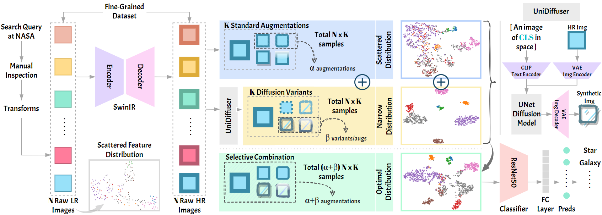

# FLARE: Diffusion-based Augmentation Method in Astronomical Imaging

[](https://arxiv.org/abs/2405.13267)
[](https://www.kaggle.com/datasets/razaimam45/spacenet-an-optimally-distributed-astronomy-data/)
[](https://opensource.org/licenses/MIT)

Official implementation of ["FLARE up your data: Diffusion-based Augmentation Method in Astronomical Imaging"](https://arxiv.org/abs/2405.13267)

## Updates
- [05/2024] 🔥 Initial release of code and pretrained models
- [05/2024] 🌟 Release of SpaceNet dataset on Kaggle

## Overview

FLARE is a two-stage augmentation framework for improving astronomical image classification. It combines traditional data augmentation with diffusion-based synthetic sample generation to enhance model performance on various downstream tasks.

<p align="center">

</p>

## Dataset

SpaceNet is available on [Kaggle](https://www.kaggle.com/datasets/razaimam45/spacenet-an-optimally-distributed-astronomy-data/). It contains:
- 12,900 high-quality astronomical images
- 8 fine-grained classes: planets, galaxies, asteroids, nebulae, comets, black holes, stars, and constellations
- 4 macro classes: Astronomical Patterns, Celestial Bodies, Cosmic Phenomena, and Stellar Objects
- Both original and augmented samples using our FLARE method

To download the dataset:
```bash
# Using Kaggle API
kaggle datasets download razaimam45/spacenet-an-optimally-distributed-astronomy-data

# Or download directly from the Kaggle website
```

## Model Zoo

We provide pretrained models for each component of our framework:

| Model | Task | Dataset | Download |
|-------|------|----------|-----------|
| SwinIR | Image Restoration | SpaceNet | [swinir_spacenet.pth](https://github.com/username/FLARE/releases/download/v1.0/swinir_spacenet.pth) |
| UniDiffuser | Image Generation | SpaceNet | [unidiffuser_spacenet.pth](https://github.com/username/FLARE/releases/download/v1.0/unidiffuser_spacenet.pth) |
| ResNet50 | Classification (Fine) | SpaceNet | [resnet50_fine.pth](https://github.com/username/FLARE/releases/download/v1.0/resnet50_fine.pth) |
| ResNet50 | Classification (Macro) | SpaceNet | [resnet50_macro.pth](https://github.com/username/FLARE/releases/download/v1.0/resnet50_macro.pth) |

Download the pretrained models:
```bash
mkdir pretrained_models
cd pretrained_models
wget https://github.com/username/FLARE/releases/download/v1.0/swinir_spacenet.pth
wget https://github.com/username/FLARE/releases/download/v1.0/unidiffuser_spacenet.pth
wget https://github.com/username/FLARE/releases/download/v1.0/resnet50_fine.pth
wget https://github.com/username/FLARE/releases/download/v1.0/resnet50_macro.pth
```

## Installation

```bash
# Clone the repository
git clone https://github.com/username/FLARE
cd FLARE

# Create a conda environment
conda create -n flare python=3.8
conda activate flare

# Install dependencies
pip install -r requirements.txt
```

## Usage

### Quick Start
```python
import torch
from models import SwinIR, DiffusionModel
from PIL import Image

# Load pretrained models
swinir = SwinIR.from_pretrained('pretrained_models/swinir_spacenet.pth')
diffusion = DiffusionModel.from_pretrained('pretrained_models/unidiffuser_spacenet.pth')

# Process an image
image = Image.open('example.jpg')
hr_image = swinir.enhance(image)
synthetic_image = diffusion.generate(hr_image)
```

### Training
```bash
# Train from scratch
python scripts/train.py --config configs/default_config.py

# Resume training from checkpoint
python scripts/train.py --config configs/default_config.py --checkpoint path/to/checkpoint.pth
```

### Evaluation
```bash
python scripts/test.py --checkpoint pretrained_models/resnet50_fine.pth --data path/to/test/data
```

### Sample Generation
```bash
python scripts/generate_samples.py --prompt "your text prompt" --num_samples 4
```

## Results

Our method achieves:
- 20.78% improvement for fine-grained tasks
- Consistent +15% improvement across different classification models
- Superior generalization on both in-domain and out-of-domain tasks

<p align="center">

</p>

## Citation

```bibtex
@article{alam2024flare,
  title={FLARE up your data: Diffusion-based Augmentation Method in Astronomical Imaging},
  author={Alam, Mohammed Talha and Imam, Raza and Guizani, Mohsen and Karray, Fakhri},
  journal={arXiv preprint arXiv:2405.13267},
  year={2024}
}
```

## License

This project is licensed under the MIT License - see the [LICENSE](LICENSE) file for details.

## Acknowledgments

- SwinIR implementation from [JingyunLiang/SwinIR](https://github.com/JingyunLiang/SwinIR)
- UniDiffuser implementation from [thu-ml/unidiffuser](https://github.com/thu-ml/unidiffuser)
- Thanks to [MBZUAI](https://mbzuai.ac.ae/) for providing computational resources

## Contact

For questions about our paper or code, please contact either:
- Mohammed Talha Alam (mohammed.alam@mbzuai.ac.ae)
- Raza Imam (raza.imam@mbzuai.ac.ae)