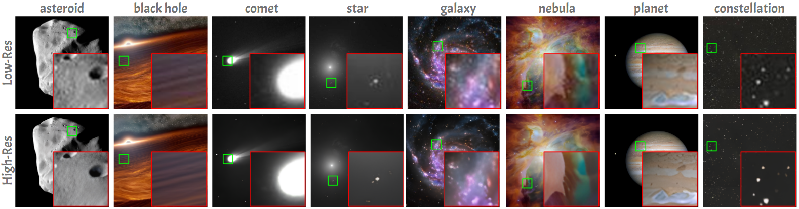
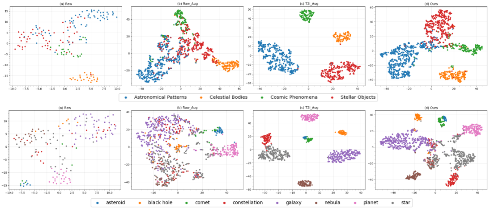

# FLARE: Diffusion-based Augmentation Method in Astronomical Imaging

[](https://arxiv.org/abs/2405.13267)
[](https://mbzuaiac-my.sharepoint.com/:b:/g/personal/mohammed_alam_mbzuai_ac_ae/EQ_RtFNYVhRKvSDt7UhKFwkBAvTlRSl327rk_BoCPWUKYQ?e=Zdf4h9)
[](https://www.kaggle.com/datasets/razaimam45/spacenet-an-optimally-distributed-astronomy-data/)
[](https://opensource.org/licenses/MIT)

Official implementation of ["FLARE up your data: Diffusion-based Augmentation Method in Astronomical Imaging"](https://arxiv.org/abs/2405.13267), accepted at **BMVC 2024** 🎉

## Updates
- [July 2024] 🎯 Paper accepted at the 35th British Machine Vision Conference (BMVC) 2024!
- [July 2024] 🌟 SpaceNet dataset released on [Kaggle](https://www.kaggle.com/datasets/razaimam45/spacenet-an-optimally-distributed-astronomy-data/)
- [Nov 2024] 📢 Code released
- [Coming Soon] 🚀 Pretrained models will be released

## Abstract
The intersection of Astronomy and AI encounters significant challenges related to issues such as noisy backgrounds, lower resolution (LR), and the intricate process of filtering and archiving images from advanced telescopes like the James Webb. Given the dispersion of raw images in feature space, we have proposed a two-stage augmentation framework entitled as FLARE based on feature learning and augmented resolution enhancement. We first apply lower (LR) to higher resolution (HR) conversion followed by standard augmentations. Secondly, we integrate a diffusion approach to synthetically generate samples using class-concatenated prompts. By merging these two stages using weighted percentiles, we realign the feature space distribution, enabling a classification model to establish a distinct decision boundary and achieve superior generalization on various in-domain and out-of-domain tasks. We conducted experiments on several downstream cosmos datasets and on our optimally distributed SpaceNet dataset across 8-class fine-grained and 4-class macro classification tasks. FLARE attains the highest performance gain of 20.78% for fine-grained tasks compared to similar baselines, while across different classification models, FLARE shows a consistent increment of an average of +15%. This outcome underscores the effectiveness of the FLARE method in enhancing the precision of image classification, ultimately bolstering the reliability of astronomical research outcomes.

## Overview

FLARE is a two-stage augmentation framework for improving astronomical image classification. It combines traditional data augmentation with diffusion-based synthetic sample generation to enhance model performance on various downstream tasks.

<p align="center">

<br>
<em>FLARE Framework: Two-stage augmentation combining traditional and diffusion-based approaches</em>
</p>

## Dataset

SpaceNet is available on [Kaggle](https://www.kaggle.com/datasets/razaimam45/spacenet-an-optimally-distributed-astronomy-data/). It contains:
- 12,900 high-quality astronomical images
- 8 fine-grained classes: planets, galaxies, asteroids, nebulae, comets, black holes, stars, and constellations
- 4 macro classes: Astronomical Patterns, Celestial Bodies, Cosmic Phenomena, and Stellar Objects
- Both original and augmented samples using our FLARE method

To download the dataset:
```bash
# Using Kaggle API
kaggle datasets download razaimam45/spacenet-an-optimally-distributed-astronomy-data

# Or download directly from the Kaggle website
```

<!-- ## Model Zoo

We provide pretrained models for each component of our framework:

| Model | Task | Dataset | Download |
|-------|------|----------|-----------|
| SwinIR | Image Restoration | SpaceNet | [swinir_spacenet.pth](https://github.com/username/FLARE/releases/download/v1.0/swinir_spacenet.pth) |
| UniDiffuser | Image Generation | SpaceNet | [unidiffuser_spacenet.pth](https://github.com/username/FLARE/releases/download/v1.0/unidiffuser_spacenet.pth) |
| ResNet50 | Classification (Fine) | SpaceNet | [resnet50_fine.pth](https://github.com/username/FLARE/releases/download/v1.0/resnet50_fine.pth) |
| ResNet50 | Classification (Macro) | SpaceNet | [resnet50_macro.pth](https://github.com/username/FLARE/releases/download/v1.0/resnet50_macro.pth) |

Download the pretrained models:
```bash
mkdir pretrained_models
cd pretrained_models
wget https://github.com/username/FLARE/releases/download/v1.0/swinir_spacenet.pth
wget https://github.com/username/FLARE/releases/download/v1.0/unidiffuser_spacenet.pth
wget https://github.com/username/FLARE/releases/download/v1.0/resnet50_fine.pth
wget https://github.com/username/FLARE/releases/download/v1.0/resnet50_macro.pth -->
```

## Installation

```bash
# Clone the repository
git clone https://github.com/username/FLARE
cd FLARE

# Create a conda environment
conda create -n flare python=3.8
conda activate flare

# Install dependencies
pip install -r requirements.txt
```

## Usage

### Quick Start
```python
import torch
from models import SwinIR, DiffusionModel
from PIL import Image

# Load pretrained models
swinir = SwinIR.from_pretrained('pretrained_models/swinir_spacenet.pth')
diffusion = DiffusionModel.from_pretrained('pretrained_models/unidiffuser_spacenet.pth')

# Process an image
image = Image.open('example.jpg')
hr_image = swinir.enhance(image)
synthetic_image = diffusion.generate(hr_image)
```

### Training
```bash
# Train from scratch
python scripts/train.py --config configs/default_config.py

# Resume training from checkpoint
python scripts/train.py --config configs/default_config.py --checkpoint path/to/checkpoint.pth
```

### Evaluation
```bash
python scripts/test.py --checkpoint pretrained_models/resnet50_fine.pth --data path/to/test/data
```

### Sample Generation
```bash
python scripts/generate_samples.py --prompt "your text prompt" --num_samples 4
```

## Results

### Out-of-Domain Performance

Our framework shows significant improvements in generalization across various downstream tasks:

| Pretrained Backbone | Method | GalaxyZoo | Space | Spiral | SpaceNet | Average |
|:-------------------|:--------|:-----------|:-------|:--------|:---------|:---------|
| ResNet-50 | Raw_LR | 33.91 | 41.67 | 83.10 | 60.68 | 54.84 |
|           | Raw_Aug_LR | **72.75** (+38.84) | 41.67 (±0.00) | 88.73 (+5.63) | 66.15 (+5.47) | 67.33 (+12.49) |
|           | **FLARE (Ours)** | 71.76 (-37.25) | **59.38** (+17.71) | **95.77** (+12.67) | **83.94** (+23.26) | **77.71** (+22.87) |
| GoogleNet | Raw_LR | 53.88 | 40.62 | 84.51 | 59.55 | 59.64 |
|           | Raw_Aug_LR | **66.46** (+12.58) | 45.83 (+5.21) | 81.69 (-2.82) | 67.18 (+7.63) | 65.29 (+5.65) |
|           | **FLARE (Ours)** | 65.84 (-11.96) | **56.25** (+15.63) | **92.96** (+8.45) | **81.29** (+21.74) | **74.09** (+14.45) |
| DenseNet-121 | Raw_LR | 37.73 | 48.96 | 80.28 | 60.27 | 56.81 |
|              | Raw_Aug_LR | **70.16** (+32.43) | 48.96 (±0.00) | 87.32 (+7.04) | 67.39 (+7.12) | 68.46 (+11.65) |
|              | **FLARE (Ours)** | 65.84 (-28.11) | **59.38** (+10.42) | **94.37** (+14.09) | **83.79** (+23.52) | **75.85** (+22.04) |
| ViT-B/16 | Raw_LR | 67.20 | 45.83 | 90.14 | 61.92 | 66.27 |
|          | Raw_Aug_LR | **93.09** (+25.89) | 44.79 (-1.04) | 87.32 (-2.82) | 68.21 (+6.29) | 73.35 (+7.08) |
|          | **FLARE (Ours)** | 83.72 (-16.52) | **55.21** (+9.38) | **98.59** (+8.45) | **82.70** (+20.78) | **80.06** (+13.79) |

### Visual Results

<p align="center">

<br>
<em>Qualitative results showing improved image quality and feature preservation</em>
</p>

<p align="center">

<br>
<em>Feature distribution analysis showing better class separation with FLARE</em>
</p>

Our method achieves:
- 20.78% improvement for fine-grained tasks
- Consistent +15% improvement across different classification models
- Superior generalization on both in-domain and out-of-domain tasks

<!-- <p align="center">

</p> -->

## Citation

```bibtex
@article{alam2024flare,
  title={FLARE up your data: Diffusion-based Augmentation Method in Astronomical Imaging},
  author={Alam, Mohammed Talha and Imam, Raza and Guizani, Mohsen and Karray, Fakhri},
  journal={arXiv preprint arXiv:2405.13267},
  year={2024}
}
```

## License

This project is licensed under the MIT License - see the [LICENSE](LICENSE) file for details.

## Acknowledgments

- SwinIR implementation from [JingyunLiang/SwinIR](https://github.com/JingyunLiang/SwinIR)
- UniDiffuser implementation from [thu-ml/unidiffuser](https://github.com/thu-ml/unidiffuser)
- Thanks to [MBZUAI](https://mbzuai.ac.ae/) for providing computational resources

## Contact

For questions about our paper or code, please contact either:
- Mohammed Talha Alam (mohammed.alam@mbzuai.ac.ae)
- Raza Imam (raza.imam@mbzuai.ac.ae)